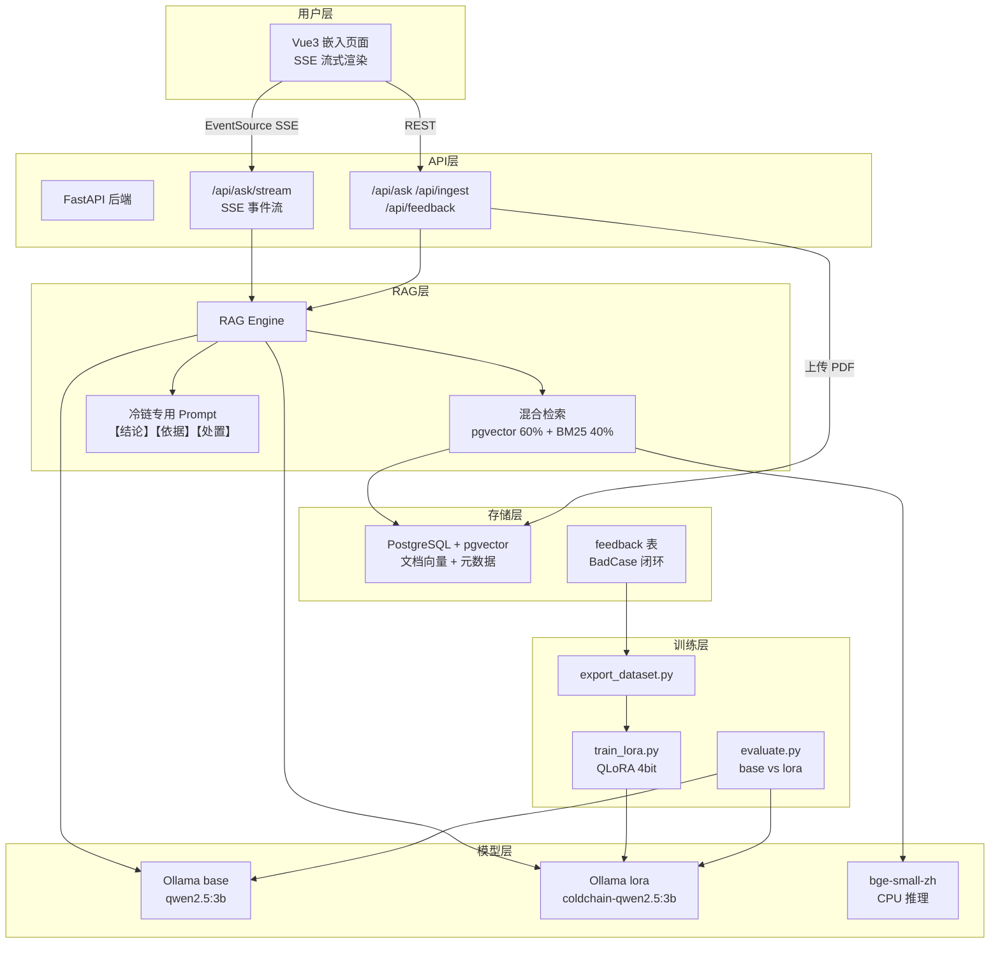
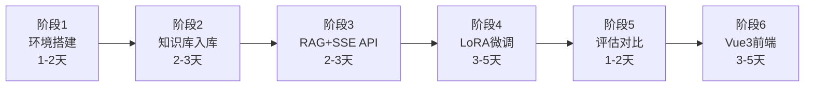
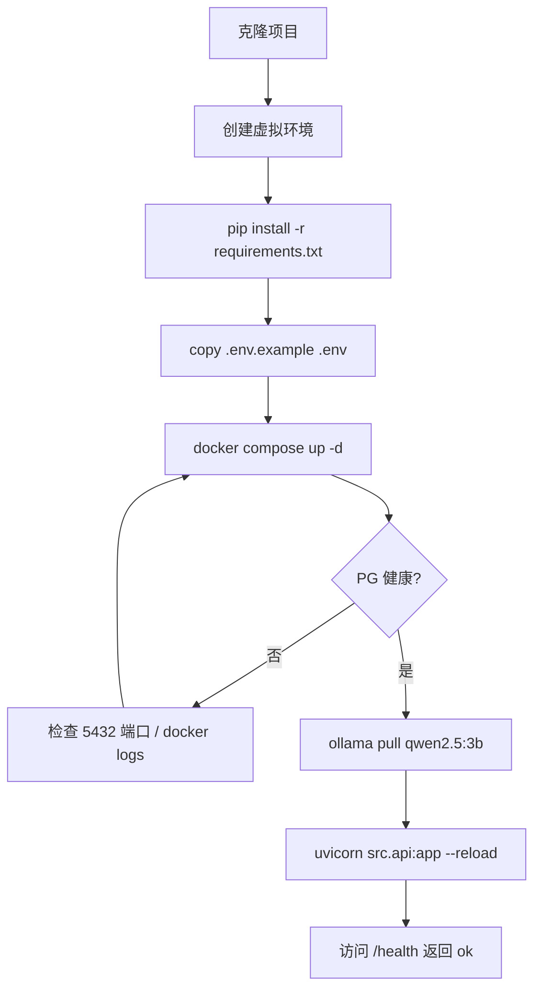
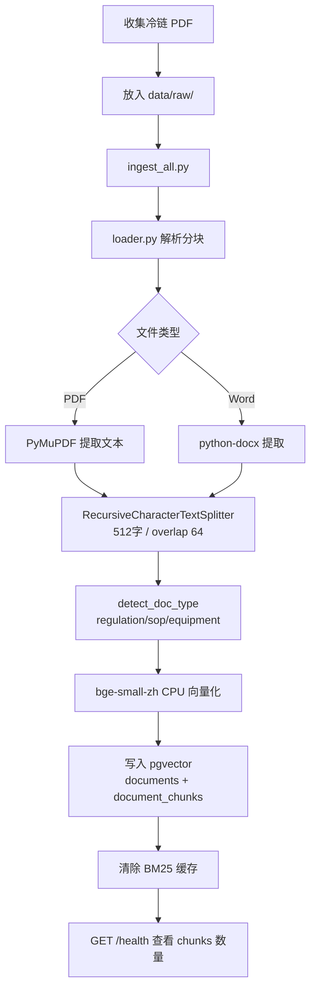
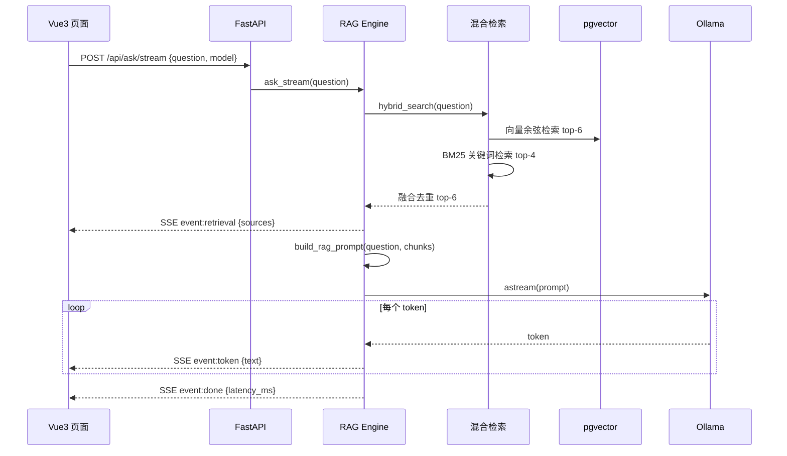
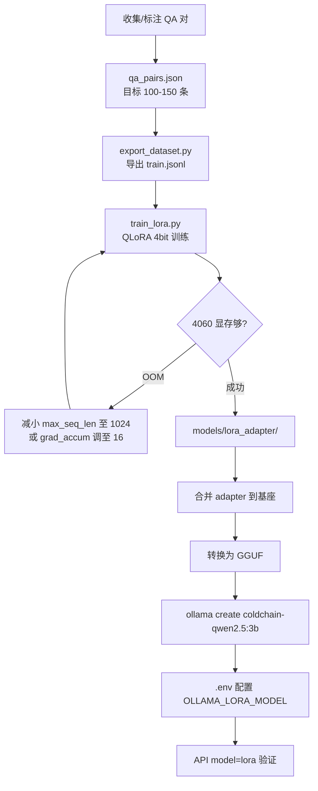
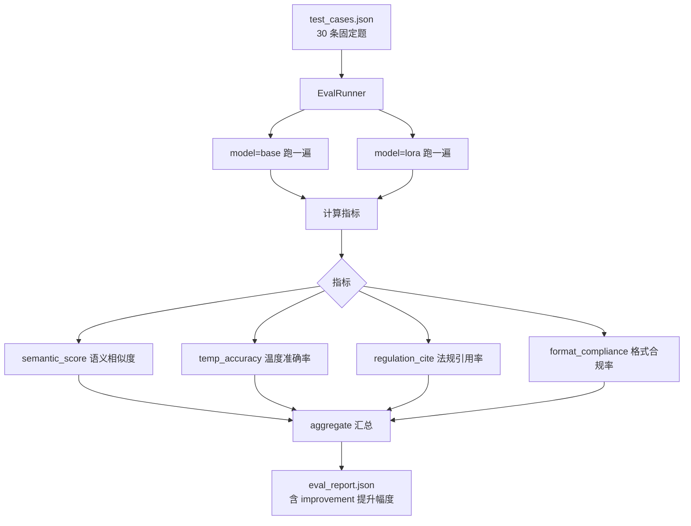
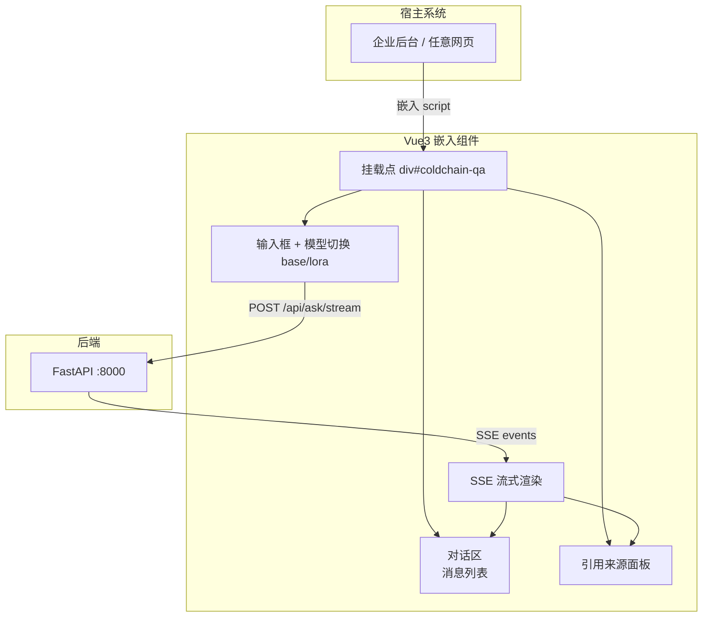
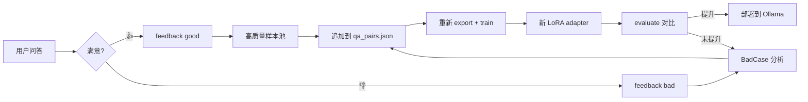

# ColdChain-QA 开发流程指南

> 冷链物流智能问答系统 · RAG + QLoRA · pgvector · SSE 流式 · Vue3 嵌入

---

## 一、项目总览



---

## 二、硬件与轻量化策略（RTX 4060 8GB）

| 组件 | 选型 | 显存/内存策略 |
|------|------|---------------|
| 基座 LLM | **Qwen2.5-3B**（非 7B） | 推理 ~2GB 显存 |
| Embedding | bge-small-zh-v1.5 | **CPU 推理**，不占 GPU |
| LoRA 训练 | QLoRA 4bit | 训练 ~6GB 显存 |
| LoRA 参数 | r=8, alpha=16 | 参数量极小 |
| 向量库 | pgvector | 无额外服务，Docker 一个 PG 容器 |
| 检索 | 向量 + BM25 | 无 FlashRank（省内存） |

**原则：推理和训练不同时跑；Embedding 固定 CPU。**

---

## 三、开发阶段总流程



| 阶段 | 目标 | 产出物 | 预计耗时 |
|------|------|--------|----------|
| 1. 环境搭建 | Docker + 依赖 + Ollama | 服务可启动 | 1-2 天 |
| 2. 知识库入库 | 冷链 PDF 解析入 pgvector | 5+ 文档入库 | 2-3 天 |
| 3. RAG + SSE API | 问答 + 流式输出调通 | API 可调用 | 2-3 天 |
| 4. LoRA 微调 | QLoRA 训练 + Ollama 部署 | 微调模型可用 | 3-5 天 |
| 5. 评估对比 | base vs lora 量化报告 | eval_report.json | 1-2 天 |
| 6. Vue3 前端 | 可嵌入页面 + SSE 渲染 | 前端 Demo | 3-5 天 |

**总计约 3-4 周。**

---

## 四、阶段 1：环境搭建

### 4.1 流程图



### 4.2 操作清单

```bash
cd E:/Learning/ColdChain-QA

# 虚拟环境
python -m venv .venv
.venv\Scripts\activate
pip install -r requirements.txt

# 配置
copy .env.example .env

# 启动基础服务
docker compose up -d

# 验证 PostgreSQL + pgvector
docker exec -it coldchain-pg psql -U coldchain -c "SELECT extversion FROM pg_extension WHERE extname='vector';"

# 拉取轻量化 LLM
ollama pull qwen2.5:3b

# 启动 API
uvicorn src.api:app --reload --port 8000
```

### 4.3 验收标准

- [ ] `GET http://localhost:8000/health` 返回 `{"status": "ok"}`
- [ ] pgvector 扩展已启用
- [ ] `ollama list` 可见 `qwen2.5:3b`

---

## 五、阶段 2：知识库入库

### 5.1 入库流程图



### 5.2 推荐文档清单

| 文档 | 类型 | 获取方式 |
|------|------|----------|
| 疫苗储存和运输管理规范 | regulation | 国家卫健委官网 |
| GB/T 28577 冷链物流规范 | regulation | 国家标准全文公开 |
| GSP 附录（冷藏冷冻药品） | regulation | 药监局 |
| 医药冷链运输 SOP | sop | 自编模板 |
| 冷藏车验证指南 | equipment | 行业培训资料 |

### 5.3 操作

```bash
# 将 PDF 放入 data/raw/ 后执行
python scripts/ingest_all.py

# 验证
curl http://localhost:8000/health
# 应看到 "chunks": N (N > 0)
```

### 5.4 验收标准

- [ ] 至少 5 份冷链文档入库
- [ ] `document_chunks` 表有数据
- [ ] 手动查询：`SELECT COUNT(*) FROM document_chunks;` > 100

---

## 六、阶段 3：RAG 问答 + SSE 流式 API

### 6.1 问答流程图



### 6.2 SSE 事件协议（Vue3 对接用）

| event | data 字段 | 说明 |
|-------|-----------|------|
| `retrieval` | `sources: [{content, source, page, score}]` | 检索完成，可渲染引用来源 |
| `token` | `text: "片段"` | LLM 生成的文本片段，追加到回答区 |
| `done` | `latency_ms: 1234` | 生成完成 |
| `error` | `message: "..."` | 错误信息 |

### 6.3 测试命令

```bash
# 非流式
curl -X POST http://localhost:8000/api/ask \
  -H "Content-Type: application/json" \
  -H "x-api-key: change-me-in-production" \
  -d "{\"question\": \"疫苗冷链运输温度范围？\", \"model\": \"base\"}"

# SSE 流式
curl -N -X POST http://localhost:8000/api/ask/stream \
  -H "Content-Type: application/json" \
  -H "x-api-key: change-me-in-production" \
  -d "{\"question\": \"疫苗冷链运输温度范围？\", \"model\": \"base\"}"
```

### 6.4 Vue3 对接示例（阶段 6 参考）

```javascript
// 使用 fetch + ReadableStream 解析 SSE（POST 方式）
async function askStream(question, model = 'base') {
  const resp = await fetch('/api/ask/stream', {
    method: 'POST',
    headers: {
      'Content-Type': 'application/json',
      'x-api-key': 'your-key',
    },
    body: JSON.stringify({ question, model }),
  });

  const reader = resp.body.getReader();
  const decoder = new TextDecoder();
  let buffer = '';

  while (true) {
    const { done, value } = await reader.read();
    if (done) break;
    buffer += decoder.decode(value, { stream: true });

    // 按 SSE 格式解析 event/data
    const lines = buffer.split('\n');
    buffer = lines.pop(); // 保留不完整行

    let eventType = '';
    for (const line of lines) {
      if (line.startsWith('event:')) eventType = line.slice(6).trim();
      if (line.startsWith('data:')) {
        const data = JSON.parse(line.slice(5).trim());
        if (eventType === 'token') appendText(data.text);
        if (eventType === 'retrieval') showSources(data.sources);
        if (eventType === 'done') showLatency(data.latency_ms);
      }
    }
  }
}
```

### 6.5 验收标准

- [ ] 非流式 `/api/ask` 返回结构化 JSON（answer + sources）
- [ ] 流式 `/api/ask/stream` 依次收到 retrieval → token × N → done
- [ ] 回答格式含【结论】【依据】
- [ ] 无文档时返回「文档中未找到相关规定」

---

## 七、阶段 4：LoRA 微调

### 7.1 微调闭环流程图



### 7.2 数据标注规范

每条 QA 必须包含：

```json
{
  "question": "用户问题",
  "context": "检索到的文档片段（训练时模拟 RAG 输入）",
  "answer": "【结论】...\n【依据】...\n【处置建议】..."
}
```

**质量要求：**
- 温度数值必须有据可查
- 至少 30% 含温度相关题（`check_temp`）
- 至少 50% 含法规引用（GSP/GB）
- 答案格式统一三段式

### 7.3 训练操作

```bash
# 安装训练依赖
pip install -r requirements-train.txt

# 扩充 data/sft/qa_pairs.json 至 100+ 条后导出
python training/export_dataset.py --input data/sft/qa_pairs.json --output data/sft/train.jsonl

# 开始训练（确保 Ollama 推理已停止，释放显存）
python training/train_lora.py
```

### 7.4 导入 Ollama（训练后）

```bash
# 方式一：使用 llama.cpp 合并 + 转 GGUF 后导入
# 1. 合并 LoRA adapter 到基座（需安装 llama.cpp 或使用 huggingface 合并脚本）
# 2. 转换 GGUF
# 3. 创建 Modelfile

# Modelfile 示例：
# FROM ./models/merged/coldchain-qwen2.5-3b.gguf
# PARAMETER temperature 0.1

ollama create coldchain-qwen2.5:3b -f Modelfile

# 验证
ollama run coldchain-qwen2.5:3b "疫苗运输温度范围？"
```

### 7.5 4060 显存不足时的降级方案

| 问题 | 解决方案 |
|------|----------|
| OOM 训练 | `LORA_MAX_SEQ_LEN=1024`，`LORA_GRAD_ACCUM=16` |
| OOM 推理 | 确保 Embedding 在 CPU（`EMBEDDING_DEVICE=cpu`） |
| 训练太慢 | 减少数据至 80 条，epochs=2 |
| 效果不好 | 增加高质量标注数据，而非加大模型 |

### 7.6 验收标准

- [ ] `models/lora_adapter/` 存在 adapter 权重
- [ ] `ollama list` 可见 `coldchain-qwen2.5:3b`
- [ ] `model=lora` 问答格式更规范、温度数值更准

---

## 八、阶段 5：评估对比

### 8.1 评估流程图



### 8.2 操作

```bash
python scripts/evaluate.py --model compare
# 输出 base vs lora 对比，报告保存到 cache/eval_report.json
```

### 8.3 简历用量化指标

从 `eval_report.json` / `cache/finetune_runs/*.json` 的 `improvement` 字段提取。

**已完成多轮对比**（15 题固定集，详见 **[FINETUNE_RESULTS.md](./FINETUNE_RESULTS.md)**）：

| 轮次 | epochs | accuracy Δ | temp Δ | 法规引用 Δ | 备注 |
|------|--------|------------|--------|------------|------|
| Run1 | 3 | -33.3% | **+16.7%** | +6.7% | 温控更准，语义掉点大 |
| Run2 | 2 | **-6.7%** | 0 | +6.7% | 语义掉点收窄，略损格式 |

| 指标 | 含义 | 目标提升 |
|------|------|----------|
| accuracy | 语义相似度 ≥ 0.75 的比例 | +10% 以上 |
| avg_temp_accuracy | 温度数值准确率 | +15% 以上 |
| avg_regulation_cite | 法规引用率 | +20% 以上 |
| avg_format | 三段式格式合规率 | +15% 以上 |

### 8.4 验收标准

- [ ] `cache/eval_report.json` 生成
- [ ] lora 至少 2 项指标优于 base
- [ ] 截图保存对比结果（放 README / 简历附件）

---

## 九、阶段 6：Vue3 可嵌入前端

### 9.1 前端架构图



### 9.2 推荐目录结构

```
frontend/
├── package.json
├── vite.config.ts
├── src/
│   ├── main.ts              # 独立运行入口
│   ├── embed.ts             # 可嵌入挂载入口
│   ├── components/
│   │   ├── ChatWidget.vue   # 主对话组件
│   │   ├── MessageList.vue
│   │   ├── SourcePanel.vue
│   │   └── ModelSwitch.vue  # base / lora 切换
│   ├── composables/
│   │   └── useSSE.ts        # SSE 流式封装
│   └── api/
│       └── client.ts        # API 调用
└── dist/
    └── embed.js             # 构建后可嵌入的 UMD 包
```

### 9.3 嵌入方式（目标）

```html
<!-- 宿主页面只需两行 -->
<div id="coldchain-qa"></div>
<script src="https://your-cdn/embed.js" data-api="http://localhost:8000" data-key="your-key"></script>
```

### 9.4 开发顺序

1. `npm create vue@latest frontend` → 选 TypeScript
2. 先实现 `useSSE.ts` 对接 `/api/ask/stream`
3. 实现 `ChatWidget.vue` 流式渲染 + 来源展示
4. 加 `ModelSwitch` 切换 base/lora
5. 配置 `embed.ts` UMD 打包，支持外部挂载
6. 处理 CORS（`.env` 的 `CORS_ORIGINS` 加前端地址）

### 9.5 验收标准

- [ ] 流式打字机效果
- [ ] 检索来源实时展示
- [ ] base / lora 模型可切换
- [ ] 可嵌入第三方页面（iframe 或 script 挂载）
- [ ] 反馈 👍/👎 调用 `/api/feedback`

---

## 十、数据闭环（长期迭代）



---

## 十一、日常开发命令速查

| 操作 | 命令 |
|------|------|
| 启动服务 | `docker compose up -d` |
| 启动 API | `uvicorn src.api:app --reload --port 8000` |
| 批量入库 | `python scripts/ingest_all.py` |
| 导出训练集 | `python training/export_dataset.py --input data/sft/qa_pairs.json` |
| LoRA 训练 | `python training/train_lora.py` |
| 评估对比 | `python scripts/evaluate.py --model compare` |
| 跑测试 | `pytest tests/ -v` |
| 查看知识库 | `curl http://localhost:8000/health` |

---

## 十二、里程碑检查清单

### MVP（第 1-2 周）
- [ ] pgvector 入库 + 混合检索
- [ ] SSE 流式 API 调通
- [ ] 10 条测试用例问答正常

### 可写简历（第 3 周）
- [ ] 100+ 条 SFT 数据
- [ ] QLoRA 训练完成
- [ ] base vs lora 评估报告有提升
- [ ] README 含架构图和指标

### 完整 Demo（第 4 周）
- [ ] Vue3 嵌入页面
- [ ] 反馈闭环
- [ ] 3 分钟演示视频

---

## 十三、简历项目描述（完成后使用）

**项目名称**：冷链物流智能问答系统（RAG + QLoRA）

**技术栈**：Python · FastAPI · PostgreSQL · pgvector · Qwen2.5-3B · QLoRA · bge-small-zh · Vue3 · SSE

**描述**：
> 面向医药冷链合规场景，从零构建垂直领域问答系统。基于 GSP/国标文档通过 pgvector 构建私有化知识库，RAG 混合检索 + SSE 流式输出；针对冷链术语与 SOP 格式，用 120 条领域 QA 对 Qwen2.5-3B 进行 QLoRA 微调（RTX 4060 8GB）；设计温度准确率、法规引用率等专属评估指标；Vue3 可嵌入组件支持第三方系统集成。

---

*文档版本：v0.1 | 更新日期：2026-07-13*
